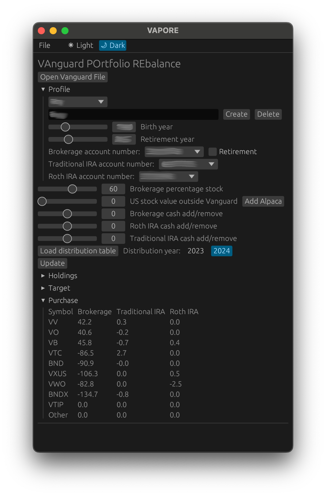

# VAnguard-POrtfolio-REbalance VAPORE
Algorithm setup to determine proper spread of Vanguard ETF index funds and adjust with the downloaded vanguards transaction file.  Current allocation:  
  
|Symbol|Description              |Type |% of type|
|------|-------------------------|-----|---------|
|VV    |US large cap stock       |Stock|22.222   |
|VO    |US mid cap stock         |Stock|22.222   |
|VB    |US small cap stock       |Stock|22.222   |
|VTC   |US total corp bond       |Bond |33.333   |
|BND   |US total bond            |Bond |33.333   |
|VXUS  |Total international stock|Stock|22.222   |
|VWO   |Emerging markets stock   |Stock|11.111   |
|BNDX  |Total international bond |Bond |33.333   |
  
The value depends on overall asset allocation.  As in, if the asset allocation is 90% stock and 10% bond, each percentage listed above is
a fraction of that 90% or 10%. For US large cap stock, the math is 90% * 22.222%.  The values above are stored within
constants in the holdings source file and can be changed there.  The default stock vs. bond distribution
is 90 vs 10 for retirement accounts and 60 vs 40 for brokerage investment accounts.  These can be changed 
through command line arguments.  
  
The algorithm is setup to shift the riskiest assets to the roth account
and the less risky assets to the traditional IRA account.  This is done to allow for the most growth to happen
within the account which does not get taxed.  
  
VTC and BND is included in order to shift money away from government bonds and into AAA corporate bonds.
There is also an equal distribution among cap sizes in order to not be over invested in large cap stocks.

## How to run
### required
- Rust installed
- Vanguard account with money in it

### Compile
Install and compile from source  
```
git clone https://github.com/Roco-scientist/VAnguard-POrtfolio-REbalance-GUI
cd VAnguard-POrtfolio-REbalance-GUI
cargo install --path .
```
  
Install and compile from crates.io  
`cargo install vapore-gui`

### Download vanguard transactions

Download transaction file from within the vanguard account  
1. Login to vanguard
2. Click on `My accounts`
3. Click on `Transaction history`
4. Click the `download` button on the right hand side
5. For Step 1, select `A spreadsheet-compatible CSV file`
6. Step 2, leave at `1 month`
7. Step 3, select all accounts
8. Click `Download` located at the bottom right
9. Move the downloaded CSV file to where you want to run this program

### Run
`vapore-gui`  
 
- Click `Open Vanguard File` and import the ofxdownload.csv file
- Type in name and click `create` to create a new profile.  This will be cached for future use.
- Enter birth year and retirement year
- Add account numbers and check the retirement box next to brokerage if the brokerage account is to be balance with the retirement accounts.
- If not using the brokerage account with retirement balancing, there is a slider for stock percentage.
- If old enough to need distributions from the traditional IRA, then `Load distribution table`.
- Click `Update` to calculate holdings and target purchases.  The calculated values can be seen in the dropdown menus
  



