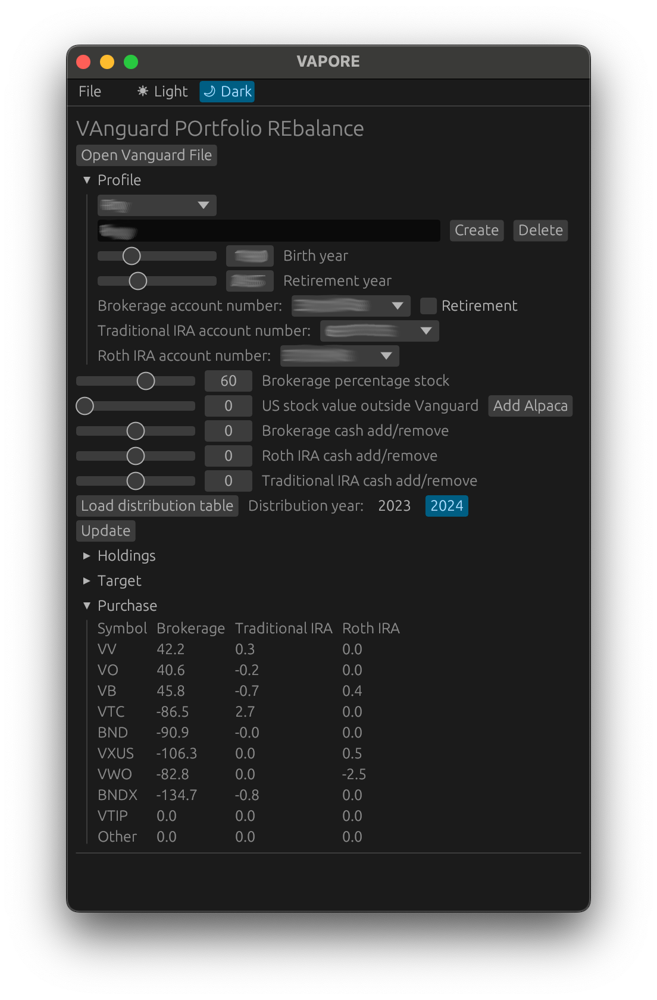

# VAnguard-POrtfolio-REbalance VAPORE

Algorithm setup to determine the proper spread of Vanguard ETF index funds and adjust it with the downloaded Vanguard transaction file. The allocation approximates, but does not copy, Vanguard's Target Retirement funds. Differences are listed below. This is a personal project and not financial advice.

## Allocation

Each fund is a fraction of its type. The type totals come from the stock/bond/inflation-protected split in the next section. For example, with 90% stock, VV is 90% * 42%.

|Symbol|Description              |Type |% of type|
|------|-------------------------|-----|---------|
|VV    |US large cap stock       |Stock|42       |
|VO    |US mid cap stock         |Stock|9        |
|VB    |US small cap stock       |Stock|9        |
|VXUS  |Total international stock|Stock|36       |
|VWO   |Emerging markets stock   |Stock|4        |
|BND   |US total bond            |Bond |52.5     |
|VTC   |US total corp bond       |Bond |17.5     |
|BNDX  |Total international bond |Bond |30       |
|VTIP  |Inflation protected      |TIPS |100      |

The fractions are constants at the top of `src/asset.rs` and can be changed there. If you change them, update this table. Notes on the choices:

- Stock is 60% US and 40% international, and bonds are 70% US and 30% international, matching Vanguard's Target Retirement funds.
- US stock is weighted roughly like the market (70% large, 15% mid, 15% small). Raising the mid and small cap weights is a deliberate bet on the size premium, not something Vanguard does.
- VXUS already holds emerging markets, so VWO is only a small extra tilt. Set `INT_EMERGING` to 0 to remove it.
- VTC adds investment-grade corporate bonds on top of BND, which already holds some. It is not AAA-rated, and corporate bonds tend to fall along with stocks in a crisis, so it is kept as a modest part of the US bonds. Set `US_CORP_BOND_FRACTION` to 0 to remove it.

## Stock/bond split

Retirement accounts follow a glide path based on retirement year, modeled on Vanguard's:

|Years to retirement|Stock %        |
|-------------------|---------------|
|25 or more         |90             |
|25 to 5            |90 down to 60  |
|5 to 0             |60 down to 50  |
|0 to 7 after       |50 down to 30  |
|More than 7 after  |30             |

Inflation protected bonds (VTIP) start at 0% five years before retirement and rise 1.8 points per year to 18% five years after. The rest is bonds. Check these figures against Vanguard's published documents, as they can change.

Brokerage accounts that are not included in retirement use a fixed stock percentage from a slider (default 65).

## Account placement

When there is more than one account:

1. **Roth IRA** fills first with the highest-risk assets (VWO, VXUS, VB, VO, VV, then bonds). Growth is tax-free and rebalancing there creates no taxable events.
2. **Brokerage** (only if checked as Retirement) fills next with tax-efficient stock index funds, with bonds and TIPS last, since their interest is taxed every year.
3. **Traditional IRA** gets what is left, which usually includes all the bonds.

This does not consider your cost basis. Check the sales it suggests before selling in a taxable account, as they can trigger capital gains. Holding VXUS and VWO in the Roth gives up the foreign tax credit available in a taxable account. The effect is small, but you can change the fill order in `src/calc.rs` if it matters to you.

## How to run

### Required

- Rust installed
- Vanguard account with money in it

### Compile

#### Local App

Install and compile from source:

```
git clone https://github.com/Roco-scientist/VAnguard-POrtfolio-REbalance-GUI
cd VAnguard-POrtfolio-REbalance-GUI
cargo install --path .
```

Install and compile from crates.io:

`cargo install vapore-gui`

#### WASM website app

Required: trunk. To install: `cargo install --locked trunk`

```
git clone https://github.com/Roco-scientist/VAnguard-POrtfolio-REbalance-GUI
cd VAnguard-POrtfolio-REbalance-GUI
```

Then either:

- `trunk build --release` to build in `./dist/`
- `trunk serve` to host locally

### Download Vanguard transactions

Download the transaction file from within the Vanguard account:

1. Login to Vanguard
2. Click on `My accounts`
3. Click on `Transaction history`
4. Click the `download` button on the right hand side
5. For Step 1, select `A spreadsheet-compatible CSV file`
6. Step 2, leave at `1 month`
7. Step 3, select all accounts
8. Click `Download` located at the bottom right
9. Move the downloaded CSV file to where you want to run this program

### Run

#### Local App

`vapore-gui`

#### Web App

Either place `./dist/` onto a web server, run `python3 -m http.server` within the folder, or run `trunk serve`.

The web app is missing some features because Yahoo does not work with WASM:

- Yahoo stock price updates are unavailable, and stock prices must be within the downloaded Vanguard file. It will therefore only fully work when all used funds are already within the portfolio.
- Distributions cannot be calculated, as the previous year's portfolio value needs Yahoo stock prices.
- Alpaca updates are not included.

#### On either version, follow the instructions below

- Click `Open Vanguard File` and import the ofxdownload.csv file.
- Type in a name and click `Create` to create a new profile. This will be cached for future use.
- Enter birth year and retirement year.
- Select the account numbers. Check the `Retirement` box next to the brokerage account if it should be balanced together with the retirement accounts.
- If the brokerage account is not balanced with retirement, use the slider to set its stock percentage.
- Use the sliders to enter any value held outside Vanguard (or `Add Alpaca`, local app only) and any cash to add to or remove from each account.
- Only with the local app: if old enough to need distributions from the traditional IRA, click `Load distribution table`.
- Click `Update target holdings` to calculate holdings and target purchases. The calculated values can be seen in the `Holdings`, `Target`, and `Purchase` dropdown menus.

All holdings are ETFs, so Vanguard's mutual fund frequent-trading limits do not apply. Vanguard's brokerage trading rules still do, for example not spending more than the settled balance in the settlement fund.


